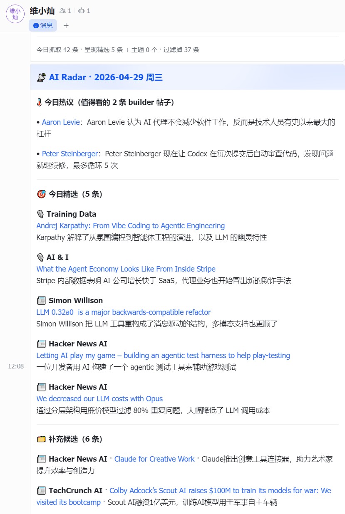

# AI Radar

AI Radar is a local-first AI information radar that helps me decide what is actually worth reading or watching each day.

It does not try to rewrite every source into a substitute artifact. Instead, it ingests a focused set of AI information sources, builds explicit candidate pools, selects a small number of worthwhile items, and delivers daily and weekly digests to Feishu.



## What Problem It Solves

Subscribing to many AI sources is easy. Actually deciding what deserves attention is the hard part.

Most existing workflows fall into one of two buckets:

- an RSS-style feed reader that still leaves all selection work to the user
- a summarization workflow that rewrites everything, but still produces too much to read

AI Radar is built around a different principle:

> do not try to read everything for the user; make the keep-or-skip decision for the user first

The daily product is intentionally selective:

- `Daily Hot Discussion`: either real builder-discussion themes, or a few worthwhile builder / X posts when no real theme forms
- `Daily Picks`: up to 5 items selected from videos, podcasts, and articles
- `Supplementary Candidates`: lightweight one-line visibility into worthwhile candidates that did not make the final picks

The weekly product adds:

- `Important Themes of the Week`
- `Top 2 Worth Watching Yourself`

## Current Coverage

This repo combines:

- YouTube channel ingestion
- RSS source ingestion
- Zara feed ingestion:
  - `zara_x`
  - `zara_blog`
  - `zara_podcast`

Current repo-managed source definitions include:

- 9 YouTube channels in [`config/channels.yaml`](config/channels.yaml)
- 4 RSS sources in [`config/rss_sources.yaml`](config/rss_sources.yaml)
- 3 Zara feeds in [`config/zara_feed.yaml`](config/zara_feed.yaml)

Representative sources include:

- `Lenny's Podcast`
- `Dwarkesh Patel`
- `Y Combinator`
- `Latent Space`
- `Training Data`
- `Simon Willison`
- `TechCrunch AI`
- `The Verge AI`
- `Hacker News AI`

## Product Logic

### Daily Pipeline

The daily digest is not generated as one monolithic AI-written report. It is split into stages:

1. `ingest`
   Fetch all new source content
2. `tier1`
   Generate lightweight summaries and keywords for every item
3. `daily-curate`
   Build explicit candidate pools first:
   - `builder_hot_candidates`
   - `editorial_candidates`
   
   Then make final daily decisions:
   - `Daily Hot Discussion`
   - `Daily Picks`
   - `Supplementary Candidates`
4. `daily`
   Render and deliver from structured outputs only

### Weekly Pipeline

The weekly digest has two layers:

- `Important Themes of the Week`
  Generated from the normalized weekly content set
- `Top 2 Worth Watching Yourself`
  Selected only from YouTube items that completed Tier 2 scoring

Weekly ranking is intentionally two-stage:

- coarse scoring on all weekly YouTube candidates
- transcript fetching and deep scoring only for Top K finalists

## Why This Project Is Different

Several decisions in this repo are deliberate:

- it treats candidate building and final recommendation as separate steps
- it does not force themes when builder discussion is too weak or too scattered
- it keeps daily output selective instead of turning into a long feed dump
- it stores normalized content locally for reproducibility and debugging
- it is designed to run on a normal Windows machine with local scheduling

## Tech Stack

| Area | Choice |
|---|---|
| Language | Python 3.11 |
| LLM | DeepSeek API |
| Ingestion | YouTube Data API, feedparser, Zara feeds |
| Transcript strategy | `youtube-transcript-api` first, `Supadata` fallback |
| Delivery | Feishu webhook interactive cards |
| Scheduling | Windows Task Scheduler |
| Storage | local markdown + JSON/JSONL, no database |

## Repository Structure

- `src/`: pipeline implementation
- `config/`: static source definitions
- `prompts/`: prompt templates
- `tests/`: unit tests
- `state/`: runtime state, candidates, themes, selections, and scores
- `transcripts/`: normalized content store, organized by `YYYY-MM-DD/source_type/`
- `reports/`: archived markdown outputs

## Local Setup

```bash
git clone https://github.com/weixiaocan/ai-information-radar.git
cd ai-information-radar
python -m venv .venv
.venv\Scripts\activate
pip install -r requirements.txt
copy .env.example .env
```

Then fill in your local `.env` with:

- DeepSeek API key
- Feishu webhook
- any other required local keys

## Common Commands

```bash
python main.py --task ingest
python main.py --task tier1
python main.py --task daily-curate
python main.py --task daily --deliver
python main.py --task tier2
python main.py --task weekly --deliver
```

## Suggested Schedule

- Daily `07:00`: `ingest`
- Daily `07:30`: `tier1`
- Daily `07:50`: `daily-curate`
- Daily `08:00`: `daily --deliver`
- Sunday `11:00`: `tier2`
- Sunday `12:00`: `weekly --deliver`

The intended daily behavior is: deliver the previous day's content around 08:00.

## Running It On Another Machine

This repo is designed so I can clone it onto another Windows machine and initialize it quickly:

```bash
git clone https://github.com/weixiaocan/ai-information-radar.git
cd ai-information-radar
python -m venv .venv
.venv\Scripts\activate
pip install -r requirements.txt
copy .env.example .env
```

Runtime directories such as `state/`, `transcripts/`, and `reports/` are intentionally not stored in GitHub and will be recreated locally.

## Public Repo Notes

The public GitHub repo intentionally excludes:

- product PRD documents
- `.env`
- `state/`
- `transcripts/`
- `reports/`

The public repository contains the code, config templates, prompts, tests, and documentation, but not private runtime data.
